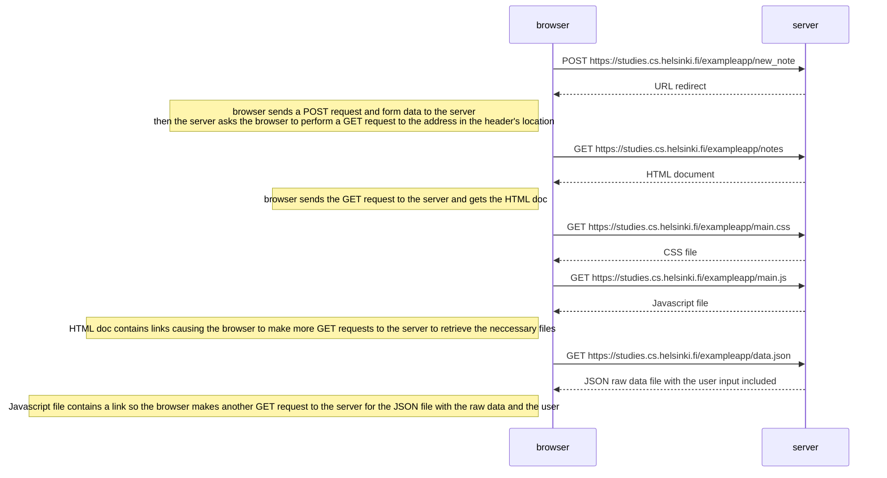

```mermaid
sequenceDiagram
    participant browser
    participant server

    browser->>server: POST https://studies.cs.helsinki.fi/exampleapp/new_note
    server-->>browser: URL redirect
    
    Note left of browser: browser sends a POST request and form data to the server<br/>then the server asks the browser to perform a GET request to the address in the header's location

    browser->>server: GET https://studies.cs.helsinki.fi/exampleapp/notes
    server-->>browser: HTML document
    
    Note left of browser: browser sends the GET request to the server and gets the HTML doc

    browser->>server: GET https://studies.cs.helsinki.fi/exampleapp/main.css
    server-->>browser: CSS file
    browser->>server: GET https://studies.cs.helsinki.fi/exampleapp/main.js
    server-->>browser: Javascript file
    
    Note left of browser: HTML doc contains links causing the browser to make more GET requests to the server to retrieve the neccessary files

    browser->>server: GET https://studies.cs.helsinki.fi/exampleapp/data.json
    server-->>browser: JSON raw data file with the user input included

    Note left of browser: Javascript file contains a link so the browser makes another GET request to the server for the JSON file with the raw data and the user
```
