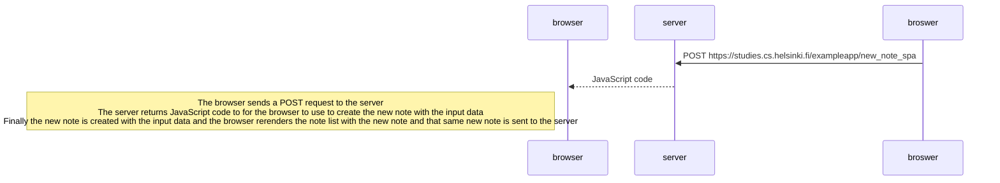

```mermaid
sequenceDiagram
    participant browser
    participant server

    broswer->>server: POST https://studies.cs.helsinki.fi/exampleapp/new_note_spa
    server-->>browser: JavaScript code

    Note left of browser: The browser sends a POST request to the server<br/>The server returns JavaScript code to for the browser to use to create the new note with the input data<br/>Finally the new note is created with the input data and the browser rerenders the note list with the new note and that same new note is sent to the server
```
